# 软件篇

## 懒人方案
压制环境及工具打包，可以直接下载解压使用，省去了新人寻找压制工具的烦恼。有能力的可以手动部署相关工具。

## 手动部署
根据需要部署不同版本的软件及依赖。

### VapourSynth
VapourSynth，简称 VS，官网是 https://www.vapoursynth.com。可以在 [Github] (https://github.com/vapoursynth/vapoursynth/releases) 上下载最新版本，包括安装版和便携版。
VS 项目开发者在 R55 引入了全新的 API4，这导致了严重的兼容性问题：API4 的 VS 虽然能够同时支持新的 API4 滤镜和旧的 API3 滤镜，但却不支持 API3 脚本。需要根据自己使用的滤镜来选择版本，笔者对动滤镜的需求不高，这里以R70版本安装为例。

前往 Github https://github.com/vapoursynth/vapoursynth/releases 下载，选择安装版本。
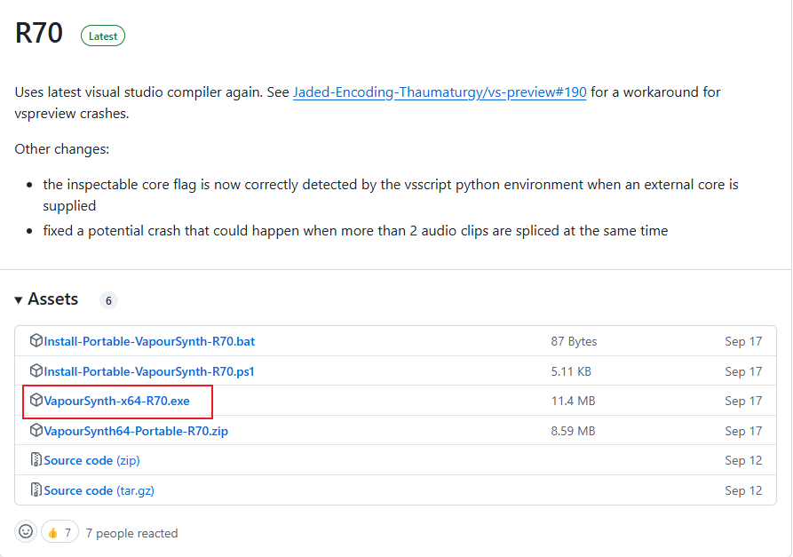

下载完成打开安装软件，选择 为所有人安装 
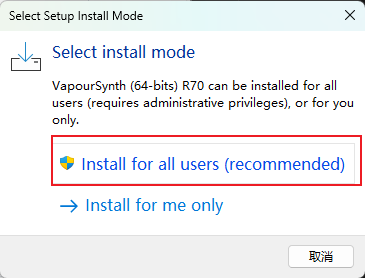

此时提示缺少python 3.1.2 或 python 3.8 64bit 版本，根据提示选择下载安装 python 3.1.2 版本。
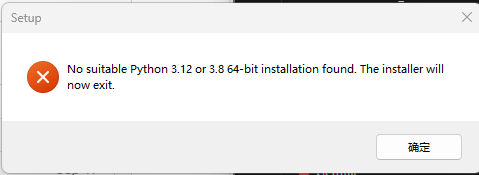

### Python安装
python 官网：https://www.python.org/ftp/python/3.12.7/python-3.12.7-amd64.exe

选择个性化安装，勾选如图两个选项
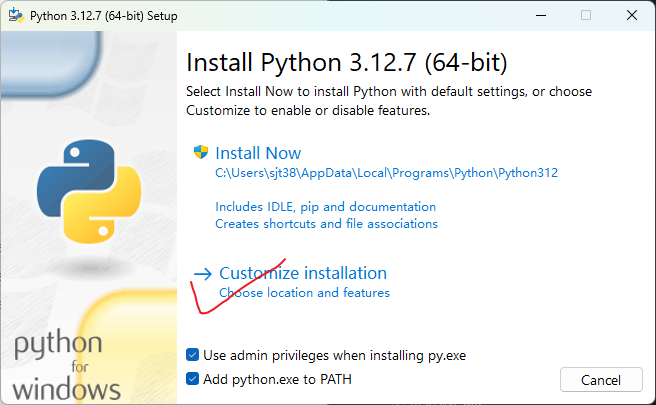

第二步，默认全部勾选
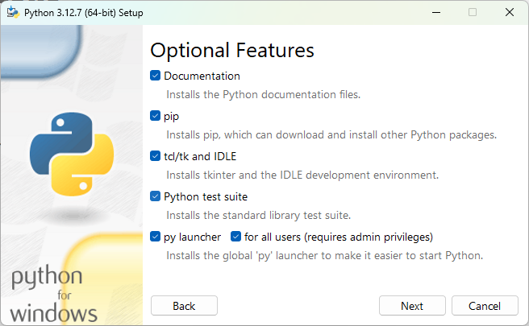

第三步，选择为所有人安装，默认安装到C盘，安装位置可自行调整。点击安装即可。
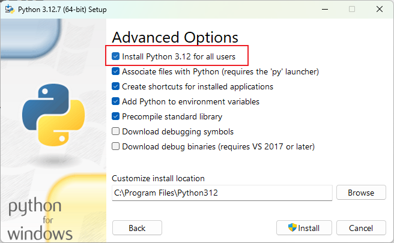

安装完毕，可选：解除Window路径长度限制。
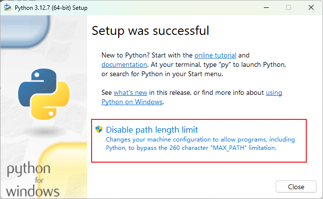

### 安装VapourSynth
点击安装，不再出现缺少python的提示，默认安装到C盘
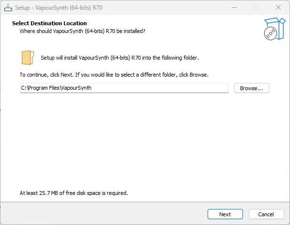

下一步，默认全部选择
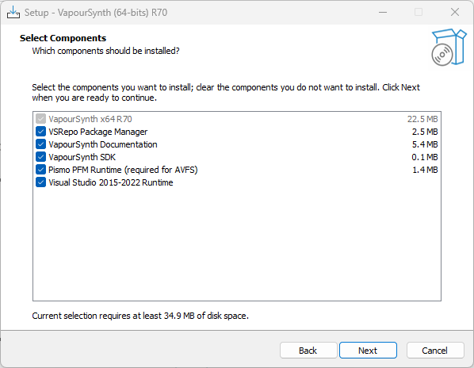

下一步，vs检测到python环境。点击继续
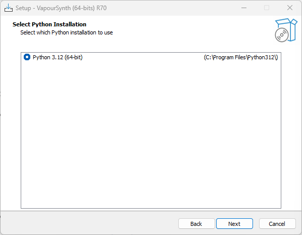

可以选择不在开始菜单创建快捷方式，这里默认。点击继续。
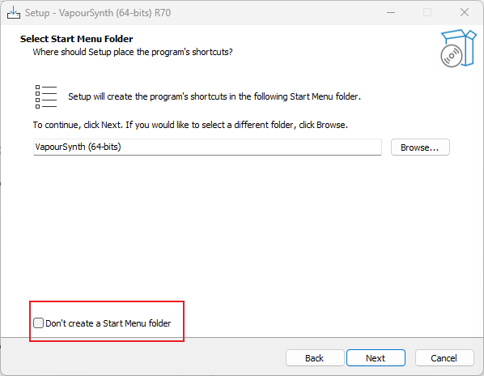

标记1，将vspipe加入到系统环境变量
标记2，将vsrepo加入到系统环境变量
VSRepo：用于下载VS相关库
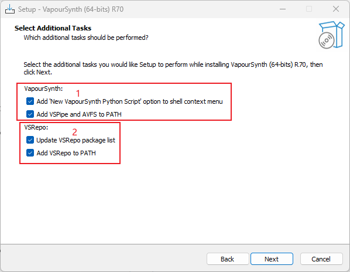

继续点击，完成安装。

### VSPreview安装
有了 VSPipe，已经可以运行 vpy 脚本输出处理结果，但无法实时修改脚本并看到输出效果，这就需要一个预览器。
这里提供几种常用的预览器：
#### VapourSynth Editor
VS Editor是目前较为广泛使用的VS编辑器。项目地址：https://github.com/YomikoR/VapourSynth-Editor
下载后，直接解压即可使用。VS Editor跟vs版本仍需要相适应，这里我们安装 VapourSynth Editor R19-mod-6.8 
https://github.com/YomikoR/VapourSynth-Editor/releases/download/R19-mod-6.8/VapourSynth.Editor-r19-mod-6.8-setup.exe

下载完成后点击安装，选择 为所有人安装
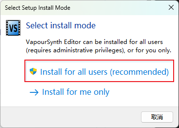

选择同意协议，点击继续
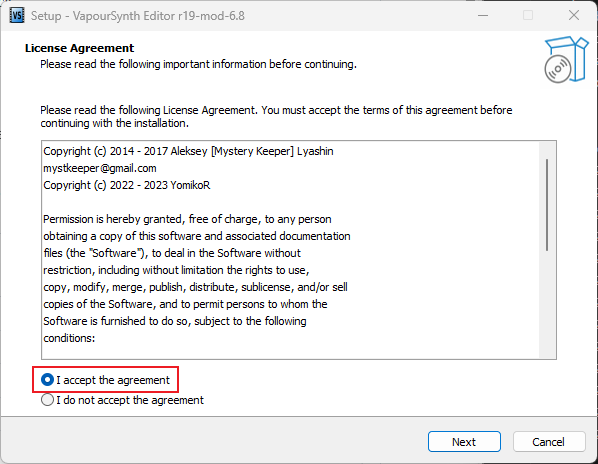

默认安装到C盘
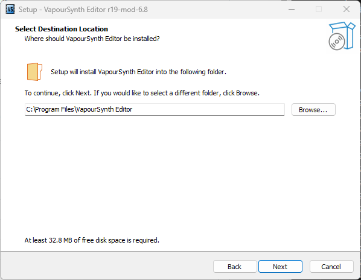

一路点击next完成安装
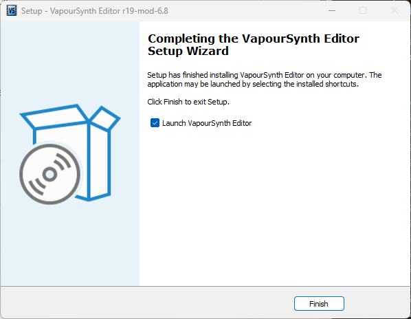

 继续安装依赖项 Runtime dependencies:Microsoft Visual C++ Redistributable X64. https://aka.ms/vs/17/release/vc_redist.x64.exe

### VSRepoGUI
官方提供了方便的下载管理插件以及脚本的GUI界面，通过软件可以查看对应的VS安装信息和脚本插件的所在位置，同时可以实现对插件的脚本安装、更新和卸载，软件插件安装位置，再右上角可以快速点开。在Windows下推荐本软件进行维护插件和脚本。
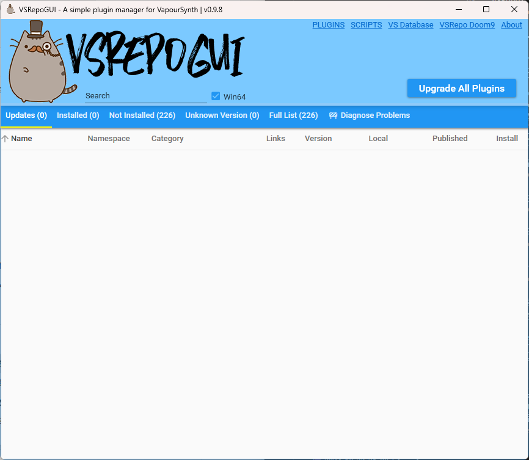

项目地址：https://github.com/theChaosCoder/VSRepoGUI
下载：https://github.com/theChaosCoder/VSRepoGUI/releases/download/v0.9.8/VSRepoGUI-0.9.8.zip

下载解压后点开后即可使用，推荐放在VS的安装目录内。
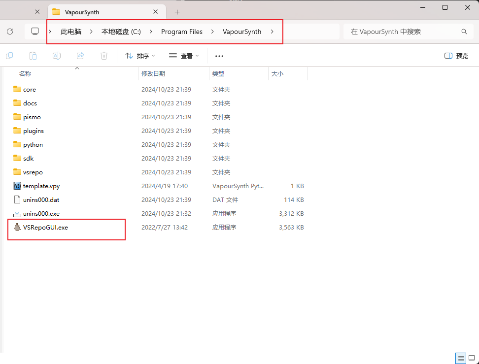

当vse提示缺少相关库时，使用VSRepoGUI进行搜索安装
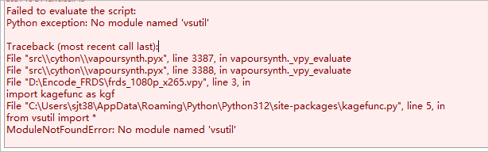

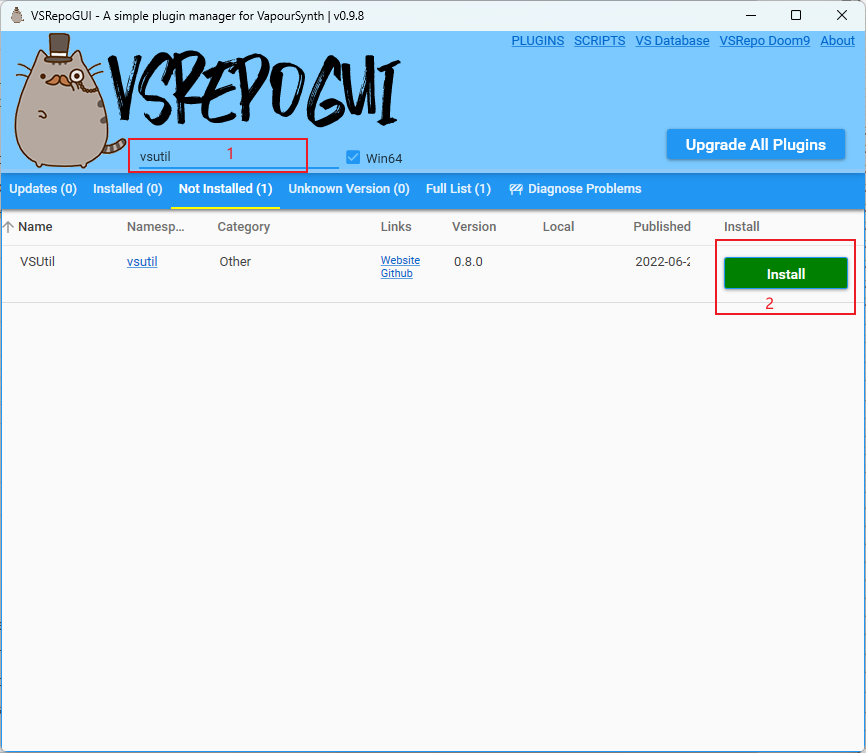

### 原盘抽流软件

HD DVD/Blu-Ray Stream Extractor:eac3to 有一个方便的 GUI，叫做 HD DVD/Blu-Ray Stream Extractor，它作为一个工具集成在 MeGUI 中。https://sourceforge.net/projects/megui/